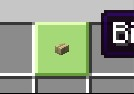
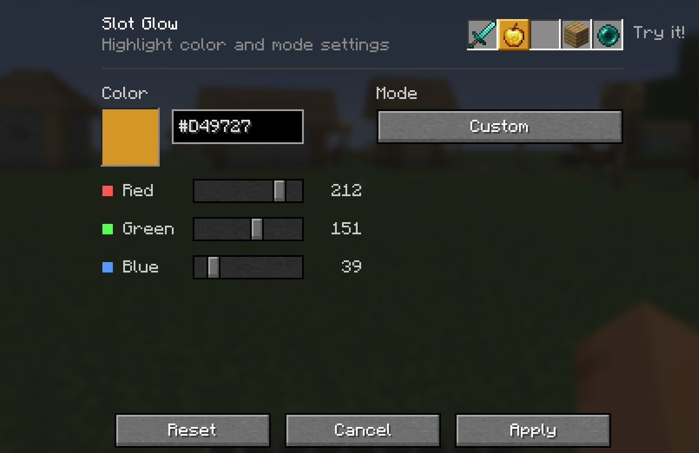

### Slot Glow

A lightweight client-side mod that replaces the vanilla slot highlight.

### Three highlight modes
* Default: vanilla behavior
* Custom: colored highlight
* Default (No Dim): vanilla highlight but removes the foreground dimming overlay

### Screenshots

  

### Configuration
Open the config screen via:
**Mods → Slot Glow → Config**, or
the command `/slotglow`

### Compatibility
* Client-side
* NeoForged 26.1.2

### License
Licensed under MIT.